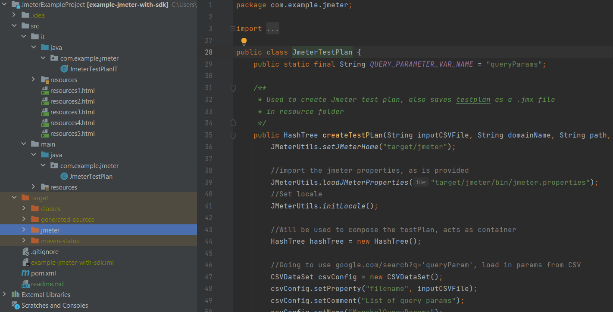

https://www.youtube.com/watch?v=Tlesg7RgKnU&ab_channel=CannedLaughter

How to create a jmeter testplan in Java using their API.

Link to example repo (look at develop branch)  : https://github.com/abe546/JmeterExamp...

Link to Jmeter Maven Plugin : https://www.youtube.com/redirect?event=video_description&redir_token=QUFFLUhqazN2aVRZZGVTd2pqUGxHRTdHcG94NlhuVGg5QXxBQ3Jtc0tubUJId3kxMk56UmdQTjFCVkpnVE5RTmxYbDVWaWxzY1dmbUhSMl9HSG9UeUpvWFpRc0JjYmNRMFVsdjBSOE8yaUJOdzItOFg2ZGhib3VCZXNDZ1dLMzBsaU9fWl9XQUYyZTlvWFZlU0VNOFZxdWJ6RQ&q=https%3A%2F%2Fgithub.com%2Fjmeter-maven-plugin%2Fjmeter-maven-plugin

